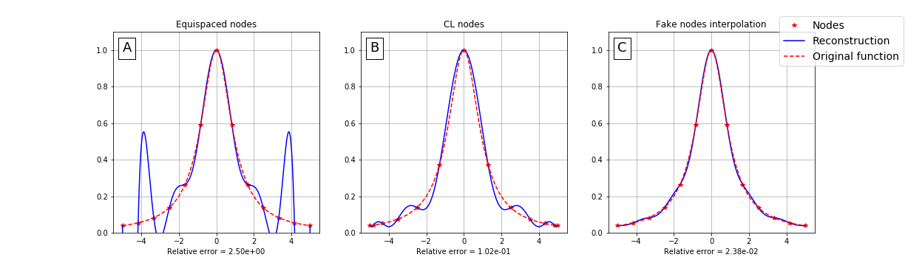
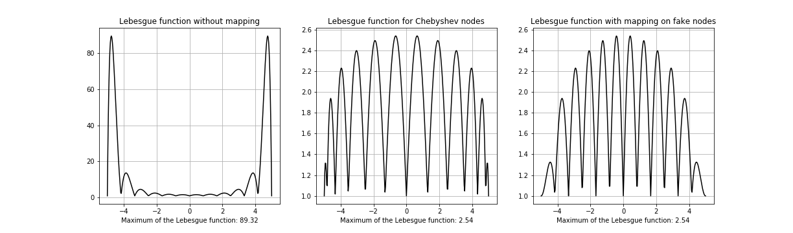
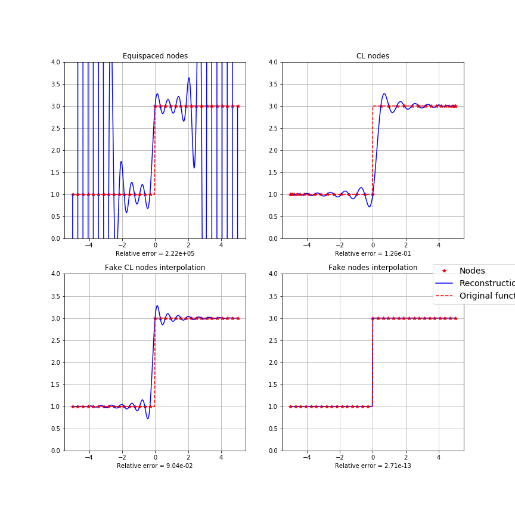

# FakeNodes
Python code for [Fake Nodes interpolation approach](FakeNodes.ipynb).

Fake nodes approach gives the possibility to obtain a better interpolation without getting new samples!


## Quote this work

To use this work in any scientific report or publication, please cite:

 * S. De Marchi, F. Marchetti, E. Perracchione, D. Poggiali, *Polynomial interpolation via mapped bases without resampling* [link](https://www.sciencedirect.com/science/article/pii/S0377042719303449), JCAM.




## What are Fake Nodes

Fake Nodes is a novel approach to numerical interpolation that aims to achieve a better interpolation without having to get new samples. You can use your samples as they were taken at better/more representative nodes, cheating with the interpolation domain by applying a map.

In terms of code: suppose you have an interpolation function

```python
def my_fancy_interpolator(x,y,xx):
  .......
  .......
  return yy
```

and a mapping `S = lambda x: ....`, if you want to use the fake nodes interpolation it is sufficient to call

```python
yy = my_fancy_interpolator(S(x),y,S(xx))
```

...very simple, isn't it? Yet the theory standing behind this scheme is not that trivial..[check it out!](https://www.sciencedirect.com/science/article/pii/S0377042719303449).



In the next notebooks, we will show the treatment of two classical phenomena in polynomial interpolation: the [Runge effect](https://en.wikipedia.org/wiki/Runge%27s_phenomenon) and the [Gibbs effect](https://en.m.wikipedia.org/wiki/Gibbs_phenomenon#Solutions).




